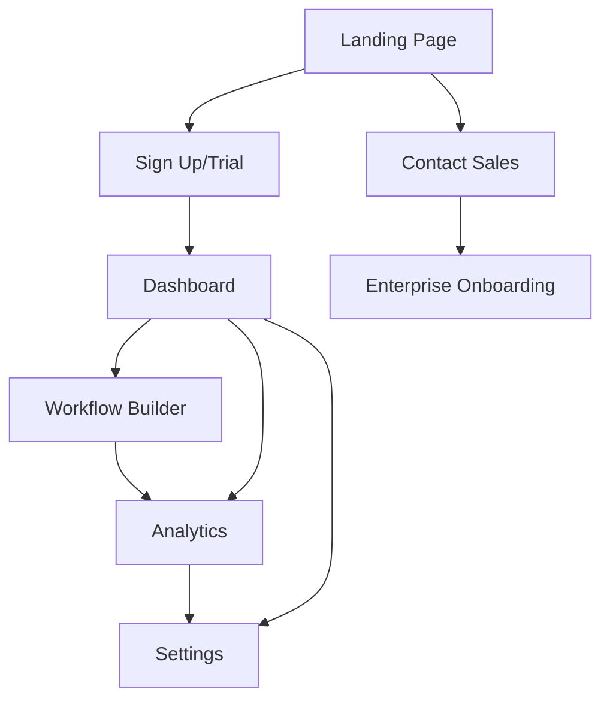

# Nkiru Technologies - Product Requirements Document

## 1. Product Overview

Nkiru Technologies provides audit-ready AI workflows for operations teams, designed to cut coordination time by 40% within 30 days. The platform offers compliant, explainable AI solutions that integrate seamlessly with existing technology stacks, targeting enterprise operations teams who need transparent, secure, and scalable workflow automation.

## 2. Core Features

### 2.1 User Roles

| Role            | Registration Method | Core Permissions                                           |
| --------------- | ------------------- | ---------------------------------------------------------- |
| Trial User      | Email registration  | Access to starter features, limited workflow builder       |
| Starter User    | Paid subscription   | Up to 5 users, workflow builder, email support             |
| Growth User     | Paid subscription   | Up to 25 users, SSO, priority support, advanced analytics  |
| Enterprise User | Sales contact       | Unlimited users, custom SLAs, dedicated CSM, private cloud |

### 2.2 Feature Module

Our Nkiru Technologies platform consists of the following main pages:

1. **Landing page**: hero section, navigation, features showcase, pricing plans, contact form
2. **Authentication pages**: sign in, sign up, password recovery
3. **Dashboard**: workflow overview, analytics, user management
4. **Workflow builder**: drag-and-drop interface, AI configuration, testing tools
5. **Analytics page**: performance metrics, ROI tracking, audit reports
6. **Settings page**: user preferences, integrations, security settings

### 2.3 Page Details

| Page Name        | Module Name         | Feature description                                                                                 |
| ---------------- | ------------------- | --------------------------------------------------------------------------------------------------- |
| Landing page     | Hero section        | Display value proposition, key benefits, and call-to-action buttons for trial signup                |
| Landing page     | Navigation          | Provide sticky header with logo, main navigation links, and authentication buttons                  |
| Landing page     | Features showcase   | Present three core features: enterprise security, fast deployment, and explainable AI               |
| Landing page     | Pricing plans       | Display three tiers (Starter, Growth, Enterprise) with monthly/yearly toggle and feature comparison |
| Landing page     | Contact form        | Enable prospect inquiries with form validation and lead capture                                     |
| Authentication   | Sign in/up          | Handle user authentication with email/password and SSO integration                                  |
| Dashboard        | Workflow overview   | Show active workflows, recent activity, and quick access to builder                                 |
| Dashboard        | Analytics summary   | Display key metrics: coordination time saved, ROI, workflow performance                             |
| Workflow builder | Visual editor       | Provide drag-and-drop interface for creating AI-powered workflows                                   |
| Workflow builder | AI configuration    | Allow prompt editing, model selection, and explainability settings                                  |
| Analytics        | Performance metrics | Track workflow efficiency, user adoption, and business impact                                       |
| Analytics        | Audit reports       | Generate compliance reports with detailed AI decision trails                                        |
| Settings         | User management     | Manage team members, roles, and permissions (Growth/Enterprise)                                     |
| Settings         | Integrations        | Configure connections to existing tools and systems                                                 |

## 3. Core Process

**Prospect Flow:**

1. User visits landing page and learns about AI workflow automation
2. User explores features, pricing, and proof points
3. User starts free trial or contacts sales for enterprise needs
4. User receives onboarding and setup assistance

**User Flow:**

1. User signs in to dashboard and views workflow overview
2. User creates new workflow using visual builder
3. User configures AI settings and tests workflow
4. User deploys workflow and monitors performance
5. User reviews analytics and generates audit reports

## 4. User Interface Design

### 4.1 Design Style

* **Primary colors**: #0B3C5D (navy blue), #9C4FFF (purple)

* **Secondary colors**: #F5F5F5 (light gray), #0A0A0A (near black)

* **Button style**: Rounded corners with solid fills and outline variants

* **Font**: Inter font family with various weights (400, 600, 800)

* **Layout style**: Clean, modern design with card-based components and generous whitespace

* **Icons**: Lucide React icons for consistency and clarity

### 4.2 Page Design Overview

| Page Name        | Module Name  | UI Elements                                                                        |
| ---------------- | ------------ | ---------------------------------------------------------------------------------- |
| Landing page     | Header       | Sticky navigation with logo, nav links, and CTA buttons using backdrop blur effect |
| Landing page     | Hero section | Large typography (text-4xl/5xl), badge component, two-column grid layout           |
| Landing page     | Features     | Three-column grid with icon, title, and description cards                          |
| Landing page     | Pricing      | Card-based layout with annual/monthly toggle switch and popular plan highlighting  |
| Dashboard        | Main layout  | Sidebar navigation, main content area with cards and data visualization            |
| Workflow builder | Canvas       | Drag-and-drop interface with toolbar, property panels, and preview area            |
| Analytics        | Charts       | Interactive charts and graphs with filtering and export capabilities               |

### 4.3 Responsiveness

The platform is designed mobile-first with responsive breakpoints:

* Mobile: Base styles with stacked layouts

* Tablet (sm): 640px+ with adjusted spacing and two-column grids

* Desktop (lg): 1024px+ with full multi-column layouts and expanded navigation

* Touch optimization for mobile workflow builder with gesture support

