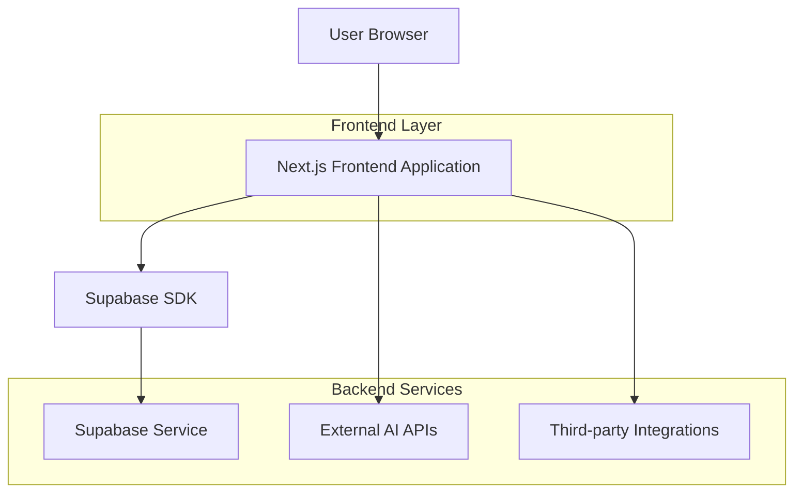
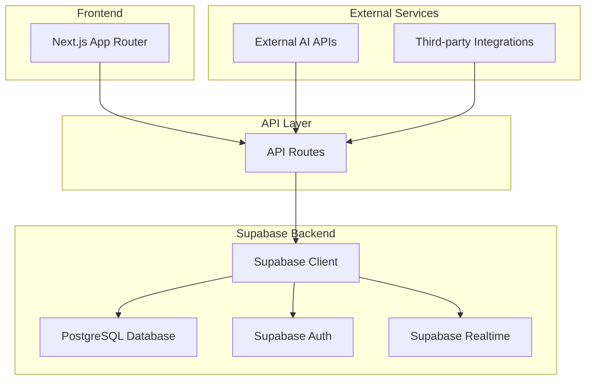
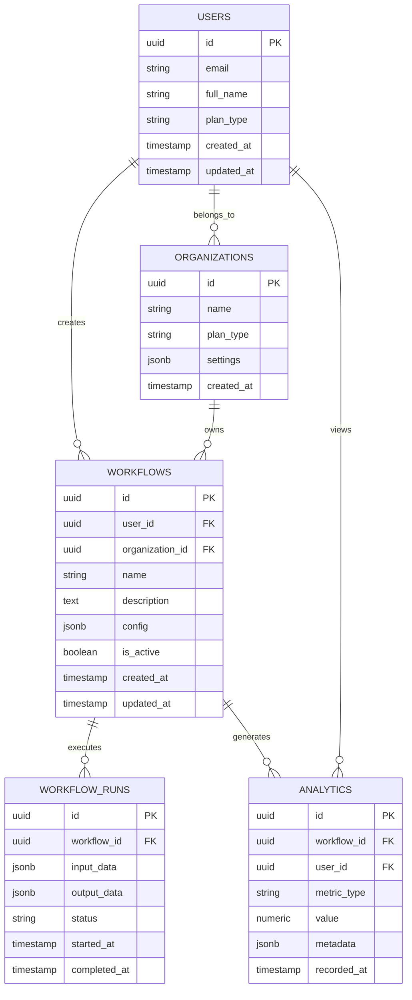

# Nkiru Technologies - Technical Architecture Document

## 1. Architecture Design



## 2. Technology Description

* Frontend: Next.js 14+ with App Router, React 18, TypeScript, Tailwind CSS

* UI Components: Radix UI primitives with custom styling

* Icons: Lucide React

* Backend: Supabase (Authentication, Database, Real-time)

* External Services: AI/ML APIs for workflow automation

* Deployment: Vercel (Frontend), Supabase (Backend services)

## 3. Route Definitions

| Route            | Purpose                                                     |
| ---------------- | ----------------------------------------------------------- |
| /                | Landing page with hero, features, pricing, and contact form |
| /sign-in         | User authentication and login                               |
| /sign-up         | User registration and trial signup                          |
| /dashboard       | Main application dashboard with workflow overview           |
| /workflows       | Workflow management and builder interface                   |
| /workflows/\[id] | Individual workflow editor and configuration                |
| /analytics       | Performance metrics and ROI tracking                        |
| /settings        | User preferences, team management, and integrations         |
| /contact         | Contact form and sales inquiry page                         |

## 4. API Definitions

### 4.1 Core API

**Authentication (Supabase Auth)**

```
POST /auth/v1/signup
POST /auth/v1/token
POST /auth/v1/logout
```

**Workflow Management**

```
GET /api/workflows
POST /api/workflows
PUT /api/workflows/[id]
DELETE /api/workflows/[id]
```

Request (Create Workflow):

| Param Name  | Param Type | isRequired | Description                |
| ----------- | ---------- | ---------- | -------------------------- |
| name        | string     | true       | Workflow name              |
| description | string     | false      | Workflow description       |
| config      | object     | true       | AI configuration and steps |
| is\_active  | boolean    | false      | Workflow status            |

Response:

| Param Name  | Param Type | Description   |
| ----------- | ---------- | ------------- |
| id          | string     | Workflow UUID |
| name        | string     | Workflow name |
| created\_at | string     | ISO timestamp |
| user\_id    | string     | Owner UUID    |

**Analytics API**

```
GET /api/analytics/metrics
GET /api/analytics/reports
```

## 5. Server Architecture Diagram



## 6. Data Model

### 6.1 Data Model Definition



### 6.2 Data Definition Language

**Users Table**

```sql
-- Create users table (extends Supabase auth.users)
CREATE TABLE public.users (
  id UUID REFERENCES auth.users(id) PRIMARY KEY,
  email VARCHAR(255) UNIQUE NOT NULL,
  full_name VARCHAR(100),
  plan_type VARCHAR(20) DEFAULT 'trial' CHECK (plan_type IN ('trial', 'starter', 'growth', 'enterprise')),
  organization_id UUID REFERENCES organizations(id),
  created_at TIMESTAMP WITH TIME ZONE DEFAULT NOW(),
  updated_at TIMESTAMP WITH TIME ZONE DEFAULT NOW()
);

-- Enable RLS
ALTER TABLE public.users ENABLE ROW LEVEL SECURITY;

-- Create policies
CREATE POLICY "Users can view own profile" ON public.users
  FOR SELECT USING (auth.uid() = id);

CREATE POLICY "Users can update own profile" ON public.users
  FOR UPDATE USING (auth.uid() = id);
```

**Organizations Table**

```sql
CREATE TABLE public.organizations (
  id UUID PRIMARY KEY DEFAULT gen_random_uuid(),
  name VARCHAR(100) NOT NULL,
  plan_type VARCHAR(20) DEFAULT 'starter' CHECK (plan_type IN ('starter', 'growth', 'enterprise')),
  settings JSONB DEFAULT '{}',
  created_at TIMESTAMP WITH TIME ZONE DEFAULT NOW(),
  updated_at TIMESTAMP WITH TIME ZONE DEFAULT NOW()
);

ALTER TABLE public.organizations ENABLE ROW LEVEL SECURITY;

CREATE POLICY "Organization members can view" ON public.organizations
  FOR SELECT USING (
    id IN (
      SELECT organization_id FROM public.users WHERE id = auth.uid()
    )
  );
```

**Workflows Table**

```sql
CREATE TABLE public.workflows (
  id UUID PRIMARY KEY DEFAULT gen_random_uuid(),
  user_id UUID REFERENCES public.users(id) NOT NULL,
  organization_id UUID REFERENCES public.organizations(id),
  name VARCHAR(100) NOT NULL,
  description TEXT,
  config JSONB NOT NULL DEFAULT '{}',
  is_active BOOLEAN DEFAULT true,
  created_at TIMESTAMP WITH TIME ZONE DEFAULT NOW(),
  updated_at TIMESTAMP WITH TIME ZONE DEFAULT NOW()
);

ALTER TABLE public.workflows ENABLE ROW LEVEL SECURITY;

CREATE POLICY "Users can manage own workflows" ON public.workflows
  FOR ALL USING (user_id = auth.uid());

CREATE POLICY "Organization members can view workflows" ON public.workflows
  FOR SELECT USING (
    organization_id IN (
      SELECT organization_id FROM public.users WHERE id = auth.uid()
    )
  );
```

**Workflow Runs Table**

```sql
CREATE TABLE public.workflow_runs (
  id UUID PRIMARY KEY DEFAULT gen_random_uuid(),
  workflow_id UUID REFERENCES public.workflows(id) ON DELETE CASCADE,
  input_data JSONB,
  output_data JSONB,
  status VARCHAR(20) DEFAULT 'pending' CHECK (status IN ('pending', 'running', 'completed', 'failed')),
  started_at TIMESTAMP WITH TIME ZONE DEFAULT NOW(),
  completed_at TIMESTAMP WITH TIME ZONE
);

ALTER TABLE public.workflow_runs ENABLE ROW LEVEL SECURITY;

CREATE POLICY "Users can view runs of their workflows" ON public.workflow_runs
  FOR SELECT USING (
    workflow_id IN (
      SELECT id FROM public.workflows WHERE user_id = auth.uid()
    )
  );
```

**Analytics Table**

```sql
CREATE TABLE public.analytics (
  id UUID PRIMARY KEY DEFAULT gen_random_uuid(),
  workflow_id UUID REFERENCES public.workflows(id),
  user_id UUID REFERENCES public.users(id),
  metric_type VARCHAR(50) NOT NULL,
  value NUMERIC NOT NULL,
  metadata JSONB DEFAULT '{}',
  recorded_at TIMESTAMP WITH TIME ZONE DEFAULT NOW()
);

ALTER TABLE public.analytics ENABLE ROW LEVEL SECURITY;

CREATE POLICY "Users can view their analytics" ON public.analytics
  FOR SELECT USING (user_id = auth.uid());

-- Create indexes
CREATE INDEX idx_workflows_user_id ON public.workflows(user_id);
CREATE INDEX idx_
```

